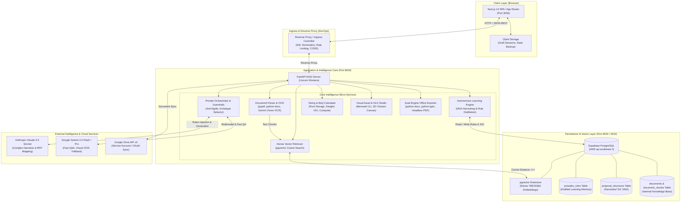
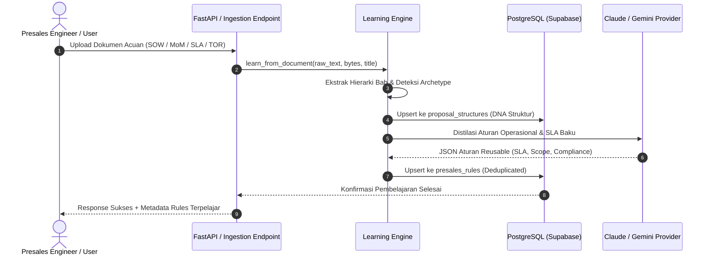
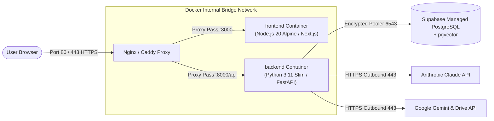

# SYNAPSE: Enterprise Proposal Accelerator & Presales Intelligence Platform
## Comprehensive System Architecture & DevOps Specification
**Target Audience**: DevOps Engineers, Enterprise Solution Architects, & Engineering Leads  
**Version**: 2.5 (Production-Ready)  
**Organization**: PT Smartnet Magna Global (SMG) — Member of CTI Group  

---

## 1. Executive Summary & Problem Statement

### 1.1 What is Synapse?
**Synapse (`knowledge-accelerator`)** adalah platform presales intelligence dan proposal automation kelas enterprise yang dirancang khusus untuk memotong waktu penyusunan proposal teknis, Statement of Work (SoW), Minutes of Meeting (MoM), dan Solution Brief dari **3–5 hari kerja menjadi < 30 menit**, dengan tingkat akurasi dan kepatuhan klausul tender mendekati 100%.

### 1.2 Core Presales Challenges Solved:
1. **Pencegahan Halusinasi (Zero-Hallucination / Anti-Ngide)**: LLM publik cenderung mengarang spesifikasi fiktif. Synapse mengunci seluruh respons pada fakta eksplisit dokumen sumber (TOR/RFP/KAK) dengan bukti sitasi klausul (`source_clause`).
2. **Anti-Bloat Architecture**: Mencegah keluaran teks generik 11+ bab yang tidak relevan. Synapse mengadaptasi arsitektur berdasarkan archetype tender (misal: *Managed Services* membuang bab Hardware Sizing & BoQ, menggantikannya dengan *24x7 Rotational Shift, Escalation SLA <5 Menit via ServiceNow, & Manpower Roster*).
3. **Autonomous Continuous Learning**: Synapse secara otomatis memanen DNA struktur (Table of Contents) dan mendistilasi aturan operasional presales dari setiap dokumen internal (SoW, MoM, PKS/SLA, Proposal, Whitepaper) yang diunggah ke dalam memori permanen PostgreSQL.

---

## 2. High-Level Architecture Diagram

Berikut adalah topologi arsitektur sistem Synapse dari Client Browser hingga Storage & LLM Provider:



---

## 3. Tech Stack Breakdown & Engineering Rationale

### 3.1 Frontend Stack

| Teknologi | Versi | Peran dalam Sistem | Alasan Pemilihan (Engineering Rationale) |
| :--- | :--- | :--- | :--- |
| **Next.js (App Router)** | `^14.2.0` | React Framework, Routing, SSR/CSR | Mendukung struktur routing modular (`/draft`, `/library`, `/search`, `/settings`), hot-reloading cepat, dan optimasi bundle production secara native. |
| **React** | `^18.3.0` | Core UI Library | Ekosistem state-management yang kaya untuk mengelola formulir presales interaktif multi-bab dan dynamic batch drafting. |
| **TypeScript** | `^5.5.0` | Static Typing | Menjamin *type-safety* 100% antara response model FastAPI Pydantic dan UI state (mencegah undefined property saat render proposal berbobot besar). |
| **Tailwind CSS** | `^3.4.4` | Styling Engine | Utility-first CSS yang sangat cepat, zero-runtime overhead, mendukung tema enterprise modern (dark/light mode) dan styling konsisten. |
| **Lucide React** | `^0.383.0` | Iconography | Tree-shakeable SVG icons ringan yang mempercepat First Contentful Paint (FCP) dibanding icon-font konvensional. |
| **React Markdown & Remark GFM** | `^10.1.0` | Markdown Parser | Merender draf teknis, formula teks, callout box, dan tabel Markdown bergaris rapi langsung di browser tanpa resiko XSS. |

---

### 3.2 Backend Stack

| Teknologi | Versi | Peran dalam Sistem | Alasan Pemilihan (Engineering Rationale) |
| :--- | :--- | :--- | :--- |
| **Python** | `3.11+` | Core Runtime | Ekosistem nomor satu untuk AI/NLP, komputasi dokumen (Docx/PPTX/PDF), serta integrasi native dengan model LLM. |
| **FastAPI** | `>=0.111.0` | High-Performance ASGI Web API | Dibangun di atas Starlette dan Pydantic; mendukung *async/await* non-blocking I/O yang krusial saat menangani LLM streaming dan I/O dokumen besar. Menyediakan autodoc Swagger `/docs`. |
| **Uvicorn** | `>=0.30.0` | ASGI Production Server | Ringan, cepat, dan standar industri untuk menjalankan aplikasi Python asinkron di dalam container Docker. |
| **SQLAlchemy (ORM & 2.0 Syntax)**| `>=2.0.0` | Data Abstraction & Session Management | Type-safe DB operations, session handling yang aman, serta integrasi mulus dengan pooling Supabase. |
| **Pydantic v2 & Pydantic Settings** | `>=2.3.0` | Data Validation & Config | Validasi berbasis Rust core (10-20x lebih cepat dibanding v1), validasi ketat terhadap format JSON LLM dan parsing file `.env`. |
| **python-docx & python-pptx** | `>=1.1.2` / `>=1.0.0` | Binary Document Synthesis | Menghasilkan dokumen resmi Word (.docx) dan presentasi eksekutif (.pptx) berstandar CTI Group lengkap dengan running header, logo resmi, styling tabel bergaris, dan penomoran hierarkis. |
| **pypdf & Gemini Vision OCR** | `>=4.2.0` | PDF Parser & Scanned Doc Fallback | Mengekstrak teks dari TOR PDF native, dan otomatis mengaktifkan OCR multimodal jika halaman terdeteksi sebagai hasil scan/gambar. |

---

### 3.3 Database & Vector Storage Stack

| Komponen | Spesifikasi / Provider | Alasan Pemilihan (Engineering Rationale) |
| :--- | :--- | :--- |
| **Database Engine** | **PostgreSQL 15+ (Hosted on Supabase)** | Relational DB paling tangguh di dunia dengan jaminan ACID, keamanan enterprise, dan backup otomatis. Region: `ap-southeast-1` (Singapore, latensi rendah dari Jakarta). |
| **Vector Engine** | **`pgvector` Extension** | Menyimpan embedding dokumen langsung di dalam PostgreSQL. **Mengeliminasi kebutuhan vector database terpisah** (seperti Pinecone/Milvus), sehingga tidak ada risiko desinkronisasi data antara metadata relasional dan vektor. |
| **Connection Pooling** | **Supabase Supavisor / Pooler (`port 6543`)** | Mencegah masalah kehabisan koneksi (*connection exhaustion*) pada traffic konkuren tinggi menggunakan transaction mode pooling. |

---

## 4. Arsitektur Subsistem Utama (Core Intelligence Engine)

### 4.1 Pipeline Pembelajaran Otonom (Autonomous Continuous Learning)
Setiap kali dokumen (SOW, MoM, Proposal, SLA/PKS, TOR) masuk ke sistem:
1. **Structural DNA Harvesting**:
   - Paragraph styles Heading 1/2/3 diekstrak bersama penomoran klausul (`1.`, `1.1`, `Bab I`).
   - Disimpan ke tabel `proposal_structures` berdasar `archetype` (`managed_services`, `hardware_infra`, `software_dev`), `doc_category`, dan `client_name`.
2. **Domain Knowledge Distillation**:
   - LLM mengekstrak 1–3 aturan presales operasional konkret (misal: *SLA Sev 1 <5 menit via ServiceNow*, *Out of scope: lisensi baru & perbaikan fisik*).
   - Aturan disimpan permanen ke tabel `presales_rules` dengan deduplikasi otomatis.
3. **Dynamic Rule Injection**:
   - Saat proposal berikutnya di-generate, fungsi `retrieve_active_rules` langsung menginjeksi seluruh aturan terpelajar ke dalam system prompt LLM.



---

### 4.2 Guardrail Anti-Halusinasi (Strict Source Grounding)
* **Kewajiban `source_clause`**: Setiap rekomendasi sub-bab **WAJIB** menyertakan kutipan kalimat atau nomor pasal asli dari dokumen acuan tender. Jika tidak ada dasarnya di dokumen sumber, sub-bab dilarang dibuat.
* **Semantic Anchor Retrieval**: Cuplikan TOR yang relevan disaring secara semantik menggunakan cosine distance (`semantic_select_tor_excerpt`), lalu diikatkan langsung ke prompt pembuatan draf bab.
* **Formula Sanitizer**: Mengubah formula LaTeX mentah (`$$...$$`) menjadi teks bersih proposal Bahasa Indonesia agar dokumen Word dan editor tidak rusak.

---

### 4.3 Studio Visual Teknis & HLD (High-Level Design)
* **Skematik / Topologi Logikal**: Menggunakan Mermaid.js yang dirender secara lokal / via Kroki menjadi SVG/PNG beresolusi tinggi.
* **2D Datacenter Rack Elevation**: Generator SVG lokal (1400x960 px) untuk menggambar rak server multi-layer lengkap dengan server, storage, dan switch berlabel.
* **Tampak Belakang Sasis (Port-Level)**: Visualisasi port dinamis (1U FortiGate HA link, 1U Cisco StackWise, 2U Pure Storage / Server).

---

## 5. Blueprint DevOps & Infrastruktur Deployment

### 5.1 Karakteristik Arsitektur untuk DevOps:
1. **100% Stateless Backend**: FastAPI tidak menyimpan session di memori lokal server. Seluruh session proposal disimpan di PostgreSQL (`proposal_sessions`) dan LocalStorage browser. Artinya, backend dapat di-scale horizontal (2–10 worker pods) di balik load balancer tanpa *sticky session*.
2. **Resource-Efficient**: Backend menggunakan model LLM berbasis API (Claude & Gemini), sehingga server host tidak memerlukan GPU khusus (vCPU dan RAM 2GB–4GB sudah sangat cukup).
3. **Strict Network Isolation**: Koneksi ke database menggunakan SSL mode (`require`) via port pooling Supabase.

---

### 5.2 Topologi Deployment Produksi (Docker Compose)

Berikut adalah arsitektur container Docker siap pakai untuk deployment on-premise atau Cloud VM (AWS EC2 / GCP Compute / Azure VM):



---

### 5.3 Konfigurasi `docker-compose.yml` Produksi

```yaml
version: '3.8'

services:
  backend:
    build:
      context: ./backend
      dockerfile: Dockerfile
    container_name: synapse-backend
    restart: always
    environment:
      - DATABASE_URL=${DATABASE_URL}
      - GOOGLE_API_KEY=${GOOGLE_API_KEY}
      - ANTHROPIC_API_KEY=${ANTHROPIC_API_KEY}
      - LLM_PROVIDER=gemini # atau claude
      - GEMINI_MODEL=gemini-flash-lite-latest
      - ANTHROPIC_MODEL=claude-3-5-sonnet-20241022
      - CORS_ORIGINS=http://localhost:3000,https://synapse.smg.co.id
    ports:
      - "8000:8000"
    healthcheck:
      test: ["CMD", "curl", "-f", "http://localhost:8000/docs"]
      interval: 30s
      timeout: 10s
      retries: 3

  frontend:
    build:
      context: ./frontend
      dockerfile: Dockerfile
    container_name: synapse-frontend
    restart: always
    environment:
      - NEXT_PUBLIC_API_BASE=http://localhost:8000
    ports:
      - "3000:3000"
    depends_on:
      - backend

networks:
  default:
    name: synapse-network
```

---

### 5.4 Dockerfile Specification

#### Backend Dockerfile (`backend/Dockerfile`):
```dockerfile
FROM python:3.11-slim

WORKDIR /app

# Install system dependencies for document handling and PDF/Word compilation
RUN apt-get update && apt-get install -y --no-install-recommends \
    build-essential \
    libpq-dev \
    curl \
    && rm -rf /var/lib/apt/lists/*

COPY requirements.txt .
RUN pip install --no-cache-dir -r requirements.txt

COPY . .

EXPOSE 8000
CMD ["uvicorn", "app.main:app", "--host", "0.0.0.0", "--port", "8000", "--workers", "4"]
```

#### Frontend Dockerfile (`frontend/Dockerfile`):
```dockerfile
FROM node:20-alpine AS builder
WORKDIR /app
COPY package*.json ./
RUN npm ci
COPY . .
RUN npm run build

FROM node:20-alpine AS runner
WORKDIR /app
ENV NODE_ENV=production
COPY --from=builder /app/package*.json ./
COPY --from=builder /app/.next ./.next
COPY --from=builder /app/public ./public
COPY --from=builder /app/node_modules ./node_modules

EXPOSE 3000
CMD ["npm", "run", "start"]
```

---

## 6. Security, Compliance & Data Governance

1. **Banking & FinServ Compliance Ready**:
   - Model prompt tidak membocorkan data antar workspace (isolasi per `workspace_id`).
   - Mendukung integrasi screening SLIK OJK dan NDA klausul perbankan langsung di draf proposal.
2. **Kerahasiaan Dokumen Tender**:
   - Teks dokumen tender diproses secara *in-memory* dan disimpan di PostgreSQL dengan koneksi terenkripsi (TLS 1.3).
   - Tidak ada data proposal klien yang dikirimkan ke model publik untuk pelatihan (*zero training retention policy* dari API enterprise Google & Anthropic).
3. **Role-Based API Design**:
   - Backend memisahkan endpoint pencarian internal (`/query`), drafting proposal (`/draft`), manajemen dokumen (`/documents`), dan pembelajaran sistem (`/draft/learn-feedback`).

---

## 7. Kesimpulan untuk Diskusi DevOps

* **Reliability**: FastAPI + PostgreSQL hosted adalah arsitektur *low-maintenance* dengan *fault-tolerance* tinggi.
* **Cost Efficiency**: Tidak memerlukan sewa server GPU mahal (menghemat jutaan rupiah/bulan dibanding self-hosted Llama/vLLM).
* **Speed to Deploy**: Containerized dan siap dideploy menggunakan Docker Compose atau helm chart Kubernetes kapan saja.
* **Extensibility**: Siap diintegrasikan dengan CI/CD pipeline (GitHub Actions / GitLab CI) untuk automated testing via `pytest` dan `npx tsc`.

---

## 8. Status Implementasi Feedback Mas Jo MS (Live Status)

| No | Rekomendasi / Pertanyaan | Status | Implementasi di Codebase |
|---|---|---|---|
| **2** | **Caching Layer (Redis / Memory TTL)** | ✅ **LIVE & ACTIVE** | [cache.py](file:///d:/Downloads/Mini%20Project/Proposal%20Acceleator/knowledge-accelerator/backend/app/services/cache.py) — Hybrid In-Memory TTL + Redis auto-detect, terintegrasi ke Claude & Gemini LLM response & recommend structure. Stats live di `/health/cache`. |
| **3** | **Global State & Revision History (Zustand)** | ✅ **LIVE & READY** | [use-draft-store.ts](file:///d:/Downloads/Mini%20Project/Proposal%20Acceleator/knowledge-accelerator/frontend/lib/stores/use-draft-store.ts) — Zustand dengan persistensi `localStorage`, atomic selectors, reordering, dan snapshot undo/restore history. |
| **4** | **Enterprise Middlewares** | ✅ **LIVE & ACTIVE** | **Backend**: Telemetry, `X-Request-ID`, `X-Process-Time`, slow-query logger, unhandled exception handler di [main.py](file:///d:/Downloads/Mini%20Project/Proposal%20Acceleator/knowledge-accelerator/backend/main.py).<br>**Frontend**: Edge security headers (`X-Frame-Options`, `nosniff`, `Referrer-Policy`) & correlation tracing di [middleware.ts](file:///d:/Downloads/Mini%20Project/Proposal%20Acceleator/knowledge-accelerator/frontend/middleware.ts). |
| **5** | **Multi-Provider Circuit Breaker & Failover** | ✅ **LIVE & ACTIVE** | [llm_provider.py](file:///d:/Downloads/Mini%20Project/Proposal%20Acceleator/knowledge-accelerator/backend/app/services/llm_provider.py) — `ResilientLLMProvider` otomatis mengalihkan (failover) request secara transparan jika provider primer terkena limit 429 atau kuota habis. |
| **6** | **Real-Time SSE Streaming** | ✅ **LIVE & ACTIVE** | [draft.py](file:///d:/Downloads/Mini%20Project/Proposal%20Acceleator/knowledge-accelerator/backend/app/routers/draft.py) — Endpoint `POST /draft/item-stream` (`text/event-stream`) untuk efek mengetik real-time (<500ms TTFT). |
| **7** | **Async Background Bulk Queue** | ✅ **LIVE & ACTIVE** | [draft.py](file:///d:/Downloads/Mini%20Project/Proposal%20Acceleator/knowledge-accelerator/backend/app/routers/draft.py) — Endpoint `POST /draft/bulk-generate-async` & `GET /draft/bulk-job/{id}` untuk mencegah HTTP Gateway Timeout 504. |
| **8** | **Document Deduplication** | ✅ **LIVE & ACTIVE** | [documents.py](file:///d:/Downloads/Mini%20Project/Proposal%20Acceleator/knowledge-accelerator/backend/app/routers/documents.py) — Mencegah penggandaan chunk pgvector saat upload ulang dokumen acuan. |
| **1** | **Security & Auth (JWT/RBAC)** | ⏳ **Next Milestone** | Sesuai roadmap, dipasang di tahap akhir wrap-up agar tidak memblok iterasi cepat fitur inti. |


